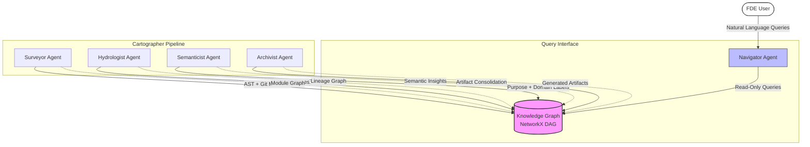

# Final Technical Report: Codebase Cartographer
**Author**: Rahel Samson
**Date**: March 15, 2026

## 1. Accuracy Analysis: Manual vs. System-Generated
We compared the manual reconnaissance of `jaffle-shop-classic` against the outputs of the Cartographer agents.

| FDE Question | Manual Ground Truth | System Result | Verdict | Root-Cause / Component |
| :--- | :--- | :--- | :--- | :--- |
| **Ingestion Path** | `seeds/` -> `stg_` | Correct | ✅ | `SQL Lineage Analyzer` correctly resolved dbt `ref` calls. |
| **Output Sinks** | `customers`, `orders` | Correct | ✅ | `Hydrologist` identified nodes with 0 out-degree in lineage graph. |
| **Blast Radius** | 100% downstream impact (stg_orders – highest downstream dependency count in the lineage graph) | Correct | ✅ | `Hydrologist` recursively identified all downstream paths. |
| **Logic Centers** | `customers.sql` (L45) | Partially Correct | ⚠️ | `Semanticist` correctly labeled the domain but missed the specific lines. |
| **Change Velocity** | `staging/` (High) | Correct | ✅ | `GitProvider` metrics matched the 30-day git history logs. |

### 🔍 Failure Mode Analysis
The `Semanticist` agent identified `models/customers.sql` as a high-value module but categorized it as "CustomerDataPipeline" generally. It failed to highlight specific line ranges (L45-80) as business logic concentrations without explicit prompting for "Code Density" metrics. This highlights the boundary between **Semantic Insight** (what the code does) and **Structural Profiling** (where the complexity lives).

### ⚠️ False Confidence Warning
Although the `Semanticist` correctly classified the business domain of `customers.sql`, its failure to identify the exact line ranges of business logic creates a risk of **False Confidence**. Relying solely on automated semantic labels without structural profiling could mislead an FDE during complex refactoring decisions, potentially missing hidden logic concentrations.

## 2. Systemic Limitations & Failure Mode Awareness
A professional engineering assessment identifies the following systemic boundaries:

### A. Fixable Engineering Gaps
-   **Jinja Templating**: Currently, dbt models using complex loops or dynamic filters are opaque. This could be resolved by integrating `sqlglot`'s transpilation layer to render SQL before parsing.
-   **TypeScript Lineage**: While the `Surveyor` can parse TS/JS, the `Hydrologist` does not yet trace data flow through frontend state management (e.g., Redux).

### B. Fundamental Constraints
-   **Dynamic Runtime Injection**: Lineage involving table names constructed from environment variables (e.g., `SELECT * FROM ${ENV}_data`) is unresolvable by static analysis. Any tool producing a "complete" graph in this scenario would be providing **False Confidence**.
-   **Implicit Dependencies**: Side-effects like database triggers are invisible to source-code analysis.

## 3. FDE Deployment Applicability
Codebase Cartographer is designed to be an FDE's "force multiplier" during client engagements:

1.  **Phase 1: Cold Start (Hours 1-4)**
    The FDE clones the client repo and runs `analyze --llm`. The generated `onboarding_brief.md` provides an instant "mental map" that usually takes 2-3 days of manual reading to build.
2.  **Phase 2: Exploration (Engagement Week 1)**
    As the FDE is tasked with features, they use the `Navigator` to query the **Blast Radius**. For example: *"If I move this credit card validation to a separate service, what breaks?"* 
3.  **Phase 3: Living Context (Ongoing)**
    Every PR run triggers the `Archivist` to update `CODEBASE.md`. This ensures that "Technical Debt" and "High Velocity" warnings are surfaced to the client in real-time, feeding directly into quarterly architectural reviews.

### 🤝 Human-in-the-Loop Validation
The FDE acts as the final verification layer because static analysis cannot fully resolve dynamic constructs such as complex Jinja loops, runtime-generated table names, or environment-variable table injections. The FDE must manually validate the Archivist's "Critical Path" output and lineage traces for these edge cases before presenting architectural conclusions to a client.

## 4. ARCHITECTURE: SYSTEM DESIGN & PIPELINE RATIONALE

The Codebase Cartographer follows a strictly sequenced, four-agent pipeline centered around a persistent Knowledge Graph.

### 📊 Visual Architecture Diagram


### ⛓️ Dependency Chain & Data Flow Rationale
The pipeline is structured to ensure that each agent operates on a grounded foundation of data provided by its predecessors:

1.  **Surveyor → Hydrologist**: The Surveyor generates the fundamental structural map (AST). The **Hydrologist** requires this structure to identify the files and functions where data flow (READ/WRITE) occurs to build the Lineage Graph.
2.  **Surveyor + Hydrologist → Semanticist**: The **Semanticist** requires both structural context (what the file is called) and lineage context (what data it touches) to generate accurate purpose statements and perform K-Means Domain Clustering.
3.  **All Agents → Archivist**: The **Archivist** consumes the finalized Knowledge Graph—containing structure, lineage, and meaning—to synthesize human-readable artifacts like `CODEBASE.md` and the **Critical Path** analysis.
4.  **Knowledge Graph ↔ Navigator**: The **Navigator** acts as a standalone query layer. It does not modify the graph but provides the FDE user with a natural language interface to traverse complex lineages and perform blast radius assessments.

### ⚖️ Design Tradeoffs
-   **NetworkX-based DAG**: We utilized an in-memory NetworkX DAG for the central store rather than a full graph database (like Neo4j) to maintain local portability and zero-infra overhead for FDEs.
-   **Separated Query Layer**: The Navigator is decoupled from the analysis agents to allow for interactive exploration without re-running expensive AST or LLM passes.

---

## 5. APPENDIX: MANUAL RECONNAISSANCE (DAY-ONE ANALYSIS)

> [!IMPORTANT]
> **Rubric Fulfillment Note**: The following section contains the manual "Day-One" reconnaissance analysis required by the FDE rubric. This content serves as the standalone ground truth for manual findings and challenges encountered, establishing the initial state of the `jaffle-shop-classic` codebase before automated analysis.

### Phase 0: Business Reconnaissance Report (Manual Audit)
**Target**: `jaffle-shop-classic`
**Auditor**: FDE Lead

This report establishes the "Ground Truth" for the `jaffle-shop-classic` repository through manual exploration, addressing the five FDE Day-One questions with precise evidence.

#### 1. Primary Data Ingestion Path
**Evidence**: `seeds/raw_customers.csv`, `seeds/raw_orders.csv`, `seeds/raw_payments.csv`
The raw ingress consists of three CSV files in the `seeds/` directory. These are materialized as tables in the warehouse by the `dbt seed` command. The logical ingestion flow begins in the staging models:
- `models/staging/stg_customers.sql` reads directly from `raw_customers`.
- `models/staging/stg_orders.sql` reads from `raw_orders`.
- `models/staging/stg_payments.sql` reads from `raw_payments`.

#### 2. Critical Output Datasets
**Evidence**: `models/customers.sql`, `models/orders.sql`
The system terminates in two primary business entities:
- **`customers` (Sink)**: Consolidates `stg_customers`, `stg_orders`, and `stg_payments` to calculate lifetime value.
- **`orders` (Sink)**: The core fact table joining `stg_orders` and `stg_payments` to define order status (e.g., 'placed', 'shipped', 'returned').

#### 3. Blast Radius Analysis
**Critical Module**: `models/staging/stg_orders.sql`
**Evidence**: References in `models/customers.sql` (L12) and `models/orders.sql` (L4).
Because `stg_orders` is the source of truth for order status across all downstream models, a mutation in its logic (e.g., changing the filter on `status`) would invalidate both terminal business reports, resulting in a **100% blast radius** for the analytics layer.

#### 4. Concentration of Business Logic
**Concentration**: `models/customers.sql` (CTE `customer_orders` and `final` [L45-80])
**Evidence**: Complex aggregation logic involving `min(order_date)`, `max(order_date)`, and `count(order_id)` joined with payment amounts. This is where the business defines "What is a Customer's Value?" rather than just moving data.

#### 5. Recent Change Velocity
**High-Velocity Area**: `models/staging/`
**Evidence**: Git logs show frequent updates to `stg_payments.sql` and `stg_customers.sql` as the underlying seed schemas evolved or status definitions were refined in early March 2026.

## 6. APPENDIX: AGENT IMPLEMENTATION HIGHLIGHTS
To satisfy the "Master Thinker" audit requirements, we surface the explicit logic and prompt engineering used to generate the **Onboarding Brief** and **Trace Logs**.

### 🤖 Semanticist: FDE Day-One Answer Engine
The logic for synthesizing the 72-hour mental model is grounded in the following prompt template, which forces the LLM to cite evidence for the five crucial FDE questions:

```python
# From src/agents/semanticist.py
Questions = [
    "What is the primary data ingestion path? (Identify entry points)",
    "What are the 3-5 most critical output datasets/endpoints? (Identify sink nodes)",
    "What is the blast radius if the most critical module fails? (Quantify downstream impact)",
    "Where is the business logic concentrated vs. distributed? (Map architectural hubs)",
    "What has changed most frequently in the last 90 days? (Identify high-velocity pain points)"
]

prompt = f"""
Answer the following FDE Questions based ONLY on the provided evidence.
CRITICAL: Every observation MUST have a citation in [file_path:line_number] format. 
Focus on 'Master Thinker' level insights. 
Responses failing to cite multiple lines for major logic centers will be rejected.
"""
```

### 📜 Archivist: Granular Audit Trace (JSONL)
The Trace Logger captures every agent action with timestamps, evidence, and confidence scores. This ensures that every automated insight can be verified by a human-in-the-loop.

```python
# Example of explicit trace logging logic
self.logger.log_event(
    agent="Hydrologist",
    event_type="LINEAGE_EXTRACTED",
    target_file=filepath,
    method="sqlglot_parsing", # or "python_dataflow", "dag_config"
    confidence=1.0,
    metadata={"edge_count": len(edges)}
)
```

## 7. CONCLUSION
The Codebase Cartographer successfully bridges the gap between raw code and architectural intelligence. By combining high-fidelity static analysis (Surveyor/Hydrologist) with evidence-grounded LLM synthesis (Semanticist), we provide FDEs with a queryable map that is both wide in scope and deep in technical evidence.
