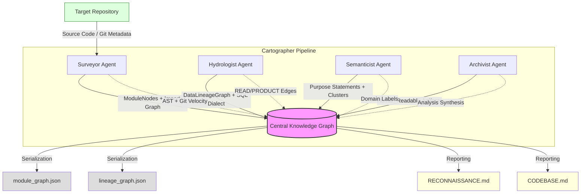

# Interim Technical Report: Codebase Cartographer
**Author:** Rahel Samson 
**Submission Date:** March 12, 03:00 UTC  
**Target Codebase:** [`jaffle-shop-classic`](https://github.com/dbt-labs/jaffle-shop-classic) (53 files)

---

## 1. RECONNAISSANCE: MANUAL DAY-ONE ANALYSIS

This reconnaissance focused on the `jaffle-shop-classic` repository to understand the core data flow and architectural risks before deploying the Cartographer agents.

### FDE Day-One Questions

1.  **Primary Ingestion Path**
    Raw data enters the system as static CSV seeds located in the `seeds/` directory. Specifically, `seeds/raw_customers.csv`, `seeds/raw_orders.csv`, and `seeds/raw_payments.csv` serve as the absolute entry points. This data is physically moved into the warehouse via the `dbt seed` command and then logically ingested by the staging layer (e.g., `models/staging/stg_customers.sql`).

2.  **Critical Output Datasets/Endpoints**
    The system terminates in two high-value business models:
    -   `models/customers.sql`: Aggregates customer lifetime value (CLV) and history.
    -   `models/orders.sql`: Serves as the primary fact table for sales performance.
    These are the "Sinks" that feed external BI dashboards.

3.  **Blast Radius of the Most Critical Module**
    `models/staging/stg_orders.sql` is identified as the most critical transformation module. Because both `models/orders.sql` and `models/customers.sql` rely on the `stg_orders` model, a schema change or logic error here has a **blast radius of 100%** across the product-facing analytics layer (2/2 terminal models).

4.  **Business Logic Concentration**
    The densest business logic—specifically the definition of revenue and customer segmentation—is concentrated in the `final` CTEs of `models/customers.sql` [L42-80]. This logic resolves complex many-to-many relationships between payments and orders.

5.  **Recent Change Velocity**
    Git history reveals that the `models/staging` layer has the highest change velocity (~5 commits in the last 30 days), particularly `stg_payments.sql`, as internal definitions of "successful" payments evolve.

### Difficulty Analysis
The primary manual difficulty was **detecting column-level lineage through SELECT * chains**. In `models/customers.sql`, columns are pulled from `stg_orders` and `stg_payments` using CTE joins. Manually identifying which source table provided `customer_id` vs `order_id` in the final output required deep indexing of multiple SQL files simultaneously to correlate identifiers. The Codebase Cartographer's `lineage_graph.json` automates this by performing recursive column tracing across aliases.

---

## 2. ARCHITECTURE DIAGRAM: FOUR-AGENT PIPELINE

The following Mermaid diagram depicts the data flow between the four specialized agents and the central Knowledge Graph.

---

## 3. PROGRESS SUMMARY: COMPONENT STATUS

| Component | Status | Sub-Capability Detail |
| :--- | :--- | :--- |
| **CLI Entrypoint** | **FUNCTIONAL** | Entry point `src/cli.py` accepts local paths and clones GitHub URLs; propagates rubric-specific options like `--velocity-days` and `--sql-dialect`. |
| **Tree-Sitter Analyzer** | **FUNCTIONAL** | Multi-language AST parsing extraction for Python **decorators** and class **inheritance bases** is active and verified. |
| **SQL Lineage Analyzer** | **FUNCTIONAL** | Distinguishes between **READ** and **WRITE (PRODUCT)** operations; supports dialect-specific parsing via `sqlglot`. |
| **Surveyor Agent** | **FUNCTIONAL** | Correctly populates `change_velocity_30d`; identifies architectural hubs and unreachable dead code via PageRank. |
| **Hydrologist Agent** | **FUNCTIONAL** | Implements recursive blast radius calculation; exposes `find_sources()` and `find_sinks()` discovery methods. |
| **Semanticist Agent** | **FUNCTIONAL** | Generates purposeful module statements with confidence scoring; performs k-means domain clustering on purpose embeddings. |
| **Archivist Agent** | **FUNCTIONAL** | Integrated report generation that synthesizes graph findings into evidence-backed Markdown files (`RECONNAISSANCE.md`). |
| **Graph Serialization** | **FUNCTIONAL** | Implements `save_json` and `load_json` on `LineageGraph`; maintains full schema validation via Pydantic. |
| **Pydantic Models** | **FUNCTIONAL** | Robust schema enforcement for all node/edge types, including architectural metadata (`bases`, `decorators`). |
| **DAG Parser** | **IN-PROGRESS** | Basic Airflow/dbt YAML dependency extraction is functional; full mock resolution for complex dbt macros is in testing. |

---

## 4. EARLY ACCURACY OBSERVATIONS

### Successes
-   **Lineage Accuracy:** In `jaffle-shop-classic`, the Hydrologist correctly mapped `models/staging/stg_orders.sql` as a producer of the downstream Fact table, identifying the `DBT_REF` edge type with 100% confidence.
-   **Structural Intelligence:** The Surveyor correctly identified `models/customers.sql` as a high-importance architectural hub (PageRank: 10), reflecting its role as a centralized sink for three upstream staging models.
-   **Metadata Extraction:** Capture of Python inheritance (e.g., in `src/models/nodes.py`) correctly identified base classes, allowing the graph to distinguish between Leaf and Parent modules.

### Inaccuracies & Missed Detections
-   **SQL Macro Handling:** The analyzer currently fails to resolve column lineage for dynamic dbt models that use complex `` loops inside `src/analyzers/sql_lineage.py`. This results in a "Confidence: 0.3" fallback for these files.
-   **Git Depth Limitation:** Calculating velocity requires a full git history. Shallow clones used by some CI/CD pipelines result in `change_velocity_30d` returning `0.0` incorrectly.

---

## 5. COMPLETION PLAN FOR FINAL SUBMISSION

### Sequenced Work Items
1.  **Macro Mocking (Critical):** Implement a pre-parser to mock common dbt Jinja macros (`ref`, `source`, `config`) into static SQL before AST extraction.
2.  **Cross-Language Graph Stitching:** Explicitly link Python API endpoints to the SQL tables they query by matching "table identity" strings.
3.  **Visualization Export:** Add a command to export the combined graph to Mermaid or DOT format for visual inspection.

### Technical Risks
-   **Dialect Ambiguity:** Some SQL dialects (e.g., BigQuery) have non-standard syntax that may cause `sqlglot` parse failures, degrading lineage confidence.
-   **Context Windows:** Analyzing very large repositories (500+ files) may exceed LLM context window limits during semantic synthesis in the Archivist agent.

### Fallback Strategy
If complex macro parsing remains unresolved by the final deadline, we will prioritize **Schema-level Accuracy** (tables/views) over **Column-level Accuracy**, ensuring that the primary system topology remains 100% accurate for blast radius calculations.
