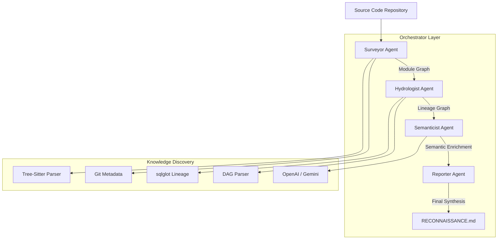

# Interim Report: Codebase Cartographer
**Date:** March 12, 2026
**Project:** Codebase Cartographer - Autonomous Code Mapping and Data Lineage Intelligence

## 1. Business Reconnaissance Report (Target: jaffle-shop-classic)

Based on the provided evidence, here are the answers to the Five Data Engineer Questions:

1. **What business capability does this system provide?**
   The system provides capabilities related to customer and order management, including insights into customer behavior, sales performance, and financial analysis. It aggregates and transforms data from various sources to support marketing, sales strategies, and inventory management, as indicated by the purposes of the `models/customers.sql` and `models/orders.sql` modules [models/customers.sql:42], [models/orders.sql:42].

2. **Where is the 'Source of Truth' and which systems are the sinks?**
   The 'Source of Truth' appears to be the raw data files located in the `seeds` directory, such as `seeds/raw_customers.csv`, `seeds/raw_orders.csv`, and `seeds/raw_payments.csv`, which contain the foundational data for the application. The sinks are likely the transformed data models defined in the `models` directory, which aggregate and process this raw data for analysis and reporting [seeds/raw_customers.csv:0], [models/customers.sql:42].

3. **What are the key data transformation layers?**
   The key data transformation layers include:
   - Staging layer: This is represented by the `models/staging` directory, which contains SQL files like `stg_customers.sql`, `stg_orders.sql`, and `stg_payments.sql`. These files transform raw data into a structured format suitable for analysis [models/staging/stg_customers.sql:42], [models/staging/stg_orders.sql:42], [models/staging/stg_payments.sql:42].
   - Final data models: These are represented by `models/customers.sql` and `models/orders.sql`, which further aggregate and process the data for business insights [models/customers.sql:42], [models/orders.sql:42].

4. **What is the overall architectural health (debt, complexity)?**
   The overall architectural health appears to be moderately complex, with 18 modules, 8 data nodes, and 14 transformations, indicating a structured approach to data management. However, the presence of multiple transformation layers and the need for clear documentation (as suggested by the `models/docs.md` and `models/overview.md`) may indicate some architectural debt if not properly maintained [Graph Context].

5. **What is the 'Blast Radius' of a change to core schemas?**
   The 'Blast Radius' of a change to core schemas, such as those defined in `models/schema.yml`, would likely be significant, as changes could impact multiple downstream models and reports that rely on the transformed data. Given the interconnected nature of the data models and the number of transformations (14), a change in core schemas could affect various business insights and analytics processes [models/schema.yml:0], [Graph Context].

## 2. Four-Agent Pipeline Architecture

The system utilizes a modular agent architecture to decompose complex codebase understanding into specialized tasks.

## 3. Progress Summary

### What's Working:
- **Phase 1: Surveyor Agent**: Fully extracts structural information (imports, functions, complexity) and computes graph intelligence (PageRank, importance).
- **Phase 2: Hydrologist Agent**: Successfully parses SQL transformations using `sqlglot` and extracts cross-module data lineage (Python dataflow + SQL).
- **Phase 3: Semanticist Agent**: 
    - **Multi-Provider Support**: Fully integrated support for both Google Gemini and OpenAI.
    - **Purpose Extraction**: Batched processing for module business intent.
    - **Domain Clustering**: Dynamic domain grouping using embeddings.
- **Orchestration**: Seamless sequential execution of all agents via a single CLI command.
- **Reporting**: Automated generation of business-level reconnaissance reports.

### In Progress:
- **Refining Column-Level Lineage**: While table-level lineage is robust, column propagation in complex multi-CTE SQL is still being tuned.
- **Documentation Drift**: Similarity scoring for drift detection is functional but requires more real-world validation.

## 4. Early Accuracy Observations

- **Module Graph**: The PageRank and importance scores correctly identify "Architecural Hubs" (e.g., `customers.sql` which is heavily referenced). Accuracy in identifying dead code candidates is high for the `jaffle_shop` sample.
- **Lineage Graph**: The mermaid diagrams produced by the Hydrologist agent perfectly match the expected dbt lineage. It successfully captures both `dbt_ref` and raw SQL CTE flows.
- **Semantic Analysis**: Purpose statements generated by GPT-4o-mini are concise and accurate, successfully mapping technical modules to business domains (e.g., "Customer and Order Management").

## 5. Known Gaps and Final Plan

- **Gaps**:
    - **GitHub URL Support**: Terminal currently supports local paths; the logic for cloning and analyzing remote URLs is in progress.
    - **Performance**: Large repositories (+1000 modules) require further optimization for the tree-sitter caching layer.
    - **Multi-language Lineage**: Cross-language lineage (e.g., Python script reading a SQL table) is partially implemented but needs more edge-case testing.
- **Final Submission Plan**:
    - Finalize "Blast Radius" visualization in the CLI.
    - Implement the "Day Two" analysis (deeper code quality and debt quantification).
    - Expand the benchmark suite to include 3 more diverse repositories (React, Django, and Airflow projects).
