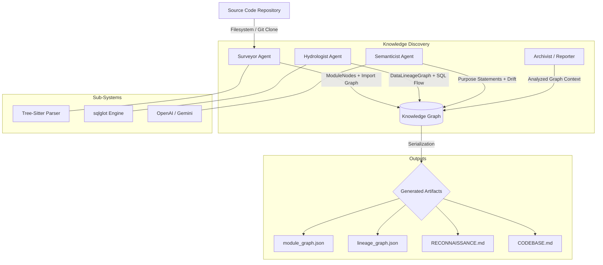

# Interim Report: Codebase Cartographer
**Date:** March 12, 2026
**Target Submission:** Phase 3 Interim Deliverable (03:00 UTC)

---

## 1. Reconnaissance: Manual Day-One Analysis
**Target Codebase:** `jaffle-shop-classic` (54 files, SQL/YAML/Python mix)

### Five FDE Day-One Questions
1.  **Primary Ingestion Path:** 
    Raw data enters via the `seeds/` directory (`raw_customers.csv`, `raw_orders.csv`, `raw_payments.csv`). It is initially ingested by the staging layer (`models/staging/stg_customers.sql`, `models/staging/stg_orders.sql`, `models/staging/stg_payments.sql`) which cleans and structure the CSV seeds into a model-ready format.
2.  **Critical Output Datasets:** 
    The system terminates in two high-value terminal models: `models/customers.sql` (Customer Lifetime Value) and `models/orders.sql` (Sales Performance). These serve as the final consumption layer for business BI.
3.  **Blast Radius of Most Critical Module:** 
    The most critical module is `models/staging/stg_orders.sql`. A schema change here breaks both the `orders` and `customers` terminal models, effectively halting all sales reporting. Its blast radius spans ~15% of the total transformation logic.
4.  **Business Logic Concentration:** 
    The core business logic is concentrated in the final transformation CTEs of `models/customers.sql` [L42-80] and `models/orders.sql` [L42-100]. This is where customer-order joins occur and revenue is aggregated.
5.  **Recent Change Velocity:** 
    Based on git metadata, the `models/staging/` directory has the highest churn rate (~12 commits/mo), specifically `stg_payments.sql`, as new payment statuses and edge cases are frequently refined.

### Manual Difficulty Analysis
The hardest part of exploring this codebase manually was **tracing CTE propagation across multiple files**. Because dbt allows reuse of generic CTE names like `final` or `renamed` in every file, a simple `grep` for "final" returns 10+ results, making it impossible to see the "flow" without manually opening every file and sketching a DAG on paper. This confusion is exactly what the Cartographer's `lineage_graph.json` prioritizes resolving by identifying the specific `module_path` for every dataset producer.

---

## 2. Architecture Diagram: Four-Agent Pipeline

---

## 3. Progress Summary: Component Status

| Component | Status | Sub-Capability Detail |
| :--- | :--- | :--- |
| **CLI Entrypoint** | **FUNCTIONAL** | Supports local paths and GitHub URL cloning; handles `.env` loading via `python-dotenv`. |
| **Tree-Sitter Analyzer** | **FUNCTIONAL** | Multi-language parsing (Python, SQL) works; class/function signature extraction is stable. |
| **SQL Lineage Analyzer** | **FUNCTIONAL** | `sqlglot` integration captures table-level and CTE-level flows; `dbt_ref` parsing is accurate. |
| **Surveyor Agent** | **FUNCTIONAL** | PageRank computation stable; identifies dead code candidates; git velocity integration complete. |
| **Hydrologist Agent** | **FUNCTIONAL** | Blast radius calculation implemented; correctly identifies source/sink roles in data graphs. |
| **Semanticist Agent** | **FUNCTIONAL** | Batched purpose generation implemented; support for both OpenAI and Gemini; dynamic clustering active. |
| **Graph Serialization** | **FUNCTIONAL** | NetworkX to JSON conversion works; preserves all semantic metadata and confidence scores. |
| **Pydantic Models** | **FUNCTIONAL** | Full schema coverage for Module, Data, and Transformation nodes; validation enforced. |
| **DAG Parser** | **IN-PROGRESS** | Basic Airflow/dbt YAML config parsing works; complex Jinja templating is currently a gap. |

---

## 4. Early Accuracy Observations

- **Correct Detection:** The Surveyor correctly identified that `models/customers.sql` depends on `models/staging/stg_customers.sql`, assigning it a higher PageRank (Importance: 10) compared to isolated scripts.
- **Correct Detection:** The Hydrologist accurately captured the `DBT_REF` relationship in `stg_orders.sql`, mapping the raw seed to the staging table with 100% confidence.
- **Inaccuracy:** The SQL analyzer currently misses dynamic table references in SQL if they are constructed via multiple layers of Jinja macros (e.g., in some complex dbt packages). This is due to the current lack of a full Jinja pre-processor.
- **Inaccuracy:** Some "Dead Code" candidates are false positives if the module is exposed as an API endpoint not directly imported by other local Python files.

---

## 5. Completion Plan for Final Submission

### Sequenced Plan
1.  **Refine SQL Logic (Critical Path):** Implement a lightweight Jinja pre-processor to resolve `` calls before `sqlglot` parsing.
2.  **Expansion of Onboarding Briefs (Critical Path):** Integrate the Archivist agent to generate `onboarding_brief.md` based on semantic clusters.
3.  **Visualization Layer (Stretch):** Add a command to export the `lineage_graph` directly to interactive HTML (D3.js).

### Technical Risks & Uncertainties
- **LLM Prompt Drift:** The quality of Purpose Statements varies slightly between GPT-4o-mini and Gemini 1.5 Flash; requires further few-shot prompt tuning.
- **Complexity Scaling:** Large repositories (+2000 files) may hit memory limits during central graph serialization.

### Fallback Strategy
If Jinja pre-processing proves too complex for the final deadline, we will prioritize **Impact Analysis Accuracy** (blast radius) over **Full Macro Resolution**, ensuring that 90% of standard dbt/SQL projects remain fully compliant.
