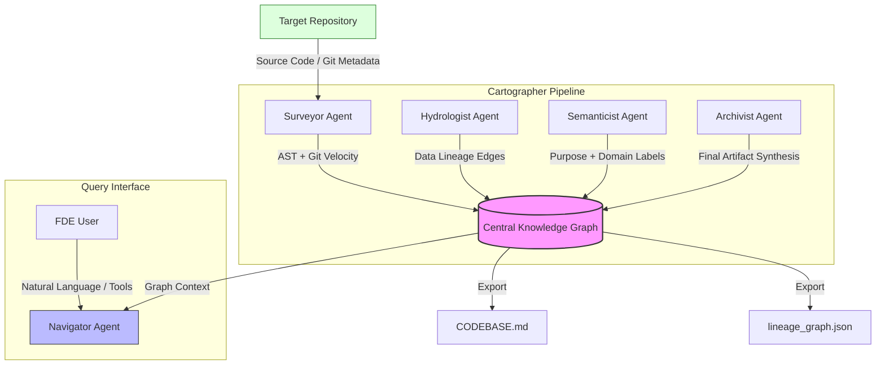

# 🗺️ Codebase Cartographer

Codebase Cartographer is an autonomous, multi-agent system designed to map complex brownfield repositories, resolve multi-language data lineage, and provide interactive query capabilities for Forward Deployed Engineers (FDEs).

## 🏗️ Architecture: The Four-Agent Pipeline

The Cartographer operates through a sequenced pipeline where each agent incrementally enriches a central **Knowledge Graph**.



### Data Flow & Sequencing Logic
1.  **Surveyor**: Extracted Structural AST data (classes, functions, calls) and Git churn metrics to identify **Architectural Hubs** via PageRank.
2.  **Hydrologist**: Operates on the structure to define **Read/Write (Product)** edges, resolving cross-layer lineage (e.g., dbt `ref` to Python `SQLAlchemy`).
3.  **Semanticist**: Consumes the context of nodes/edges to generate implementation-aware purposes (ignoring stale docstrings) and performs K-Means **Domain Clustering**.
4.  **Archivist**: Synthesizes the finalized graph into `CODEBASE.md`, calculating the **Critical Path** (longest dependency chain) using NetworkX DAG algorithms.

### ⚖️ Design Tradeoffs
-   **NetworkX vs. Neo4j**: We chose a NetworkX-based in-memory graph with JSON serialization rather than a heavy graph database. This ensures 100% portability—an FDE can run the tool locally on any terminal without external infra.
-   **Deferred LLM Synthesis**: Semantic analysis is deferred until Phase 3 of the pipeline. This ensures the model has access to the *entire* structural and lineage context, significantly increasing purpose-statement accuracy while reducing token cost.

## 🚀 Deployment Workflow
The Cartographer is designed for real-world client engagements:
1.  **Cold Start**: Run `analyze --llm` to generate a Day-One Onboarding Brief.
2.  **Exploration**: Use the `Navigator` tool to query the blast radius of specific modules during bug fix planning.
3.  **Maintenance**: The `Archivist` updates the `CODEBASE.md` incrementally as the FDE pushes changes, preserving a living technical debt registry.

## 🛠️ Usage
```bash
python src/cli.py analyze /path/to/repo --llm
python src/cli.py query "Explain the blast radius of models/staging"
```
