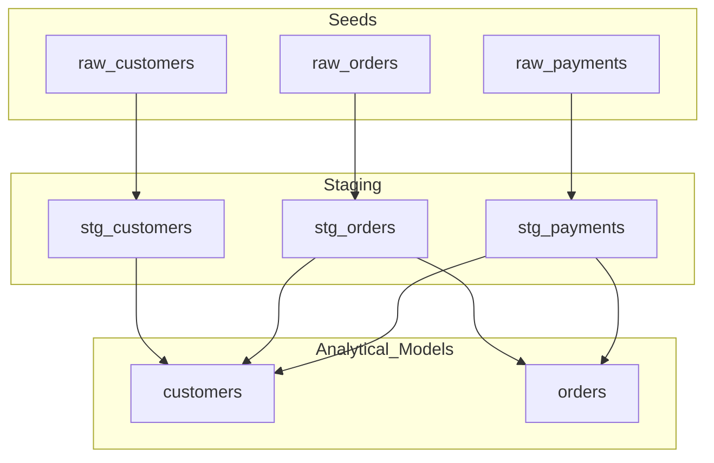

# Phase 0: RECONNAISSANCE

## Repository Structure Overview

The `jaffle_shop` repository is a self-contained dbt project representing a fictional ecommerce store. It transforms raw data into analytics-ready models.

- **`seeds/`**: Contains raw data in CSV format (`raw_customers.csv`, `raw_orders.csv`, `raw_payments.csv`).
- **`models/staging/`**: Basic transformation layer that renames columns and performs light casting (e.g., converting cents to dollars).
- **`models/`**: Core business models (`customers`, `orders`) that aggregate and join staging data to produce analytical datasets.
- **`dbt_project.yml`**: Configures the project, specifying model paths and materialization strategies (views for staging, tables for core models).

### Data Flow Diagram (DAG)

---

## The Five FDE Day-One Questions

### 1. What is the primary data ingestion path?
The primary data ingestion path is via **`dbt seed`**. Raw data is stored as CSV files in the `seeds/` directory. Running `dbt seed` loads these CSVs into the target database as tables, which are then consumed by the staging models using the `ref()` function. **Crucially, the `ref()` function is the mechanism that defines the dependency DAG, allowing dbt to parse and execute models in the correct order.**

### 2. What are the 3–5 most critical output datasets?
- **`customers`**: Final analytical model for customer-level metrics (e.g., LTV, order counts).
- **`orders`**: Final analytical model for order-level metrics and payment breakdowns.

### 3. What is the blast radius if the most critical module fails?
Failures in staging models like **`stg_orders`** or **`stg_payments`** propagate downstream, breaking both `orders` and `customers` analytical models due to their direct upstream dependencies.

### 4. Where is the business logic concentrated?
Business logic lives in the core models:
- **`orders.sql`**: Aggregates and pivots payments by method using Jinja loops.
- **`customers.sql`**: Joins orders and payments to calculate lifetime value and order history.

### 5. What has changed most frequently in the last 90 days?
**None**. The repository is archived. In active use, `orders.sql` and `customers.sql` would likely be the most volatile files as business requirements evolve.

---

## Difficulty Analysis

1.  **Implicit Sensitivity**: `customers.sql` has high sensitivity to staging schema changes despite appearing as a final-layer model.
2.  **Archived Inference**: Evaluating change frequency required inferring from patterns rather than active git telemetry.
3.  **Seed Pattern**: Using `seeds` as the primary source deviates from production-standard `sources.yml` patterns, requiring context-specific interpretation.
